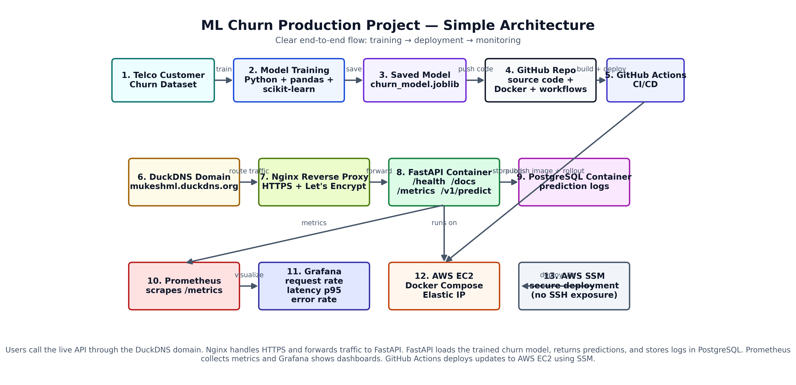
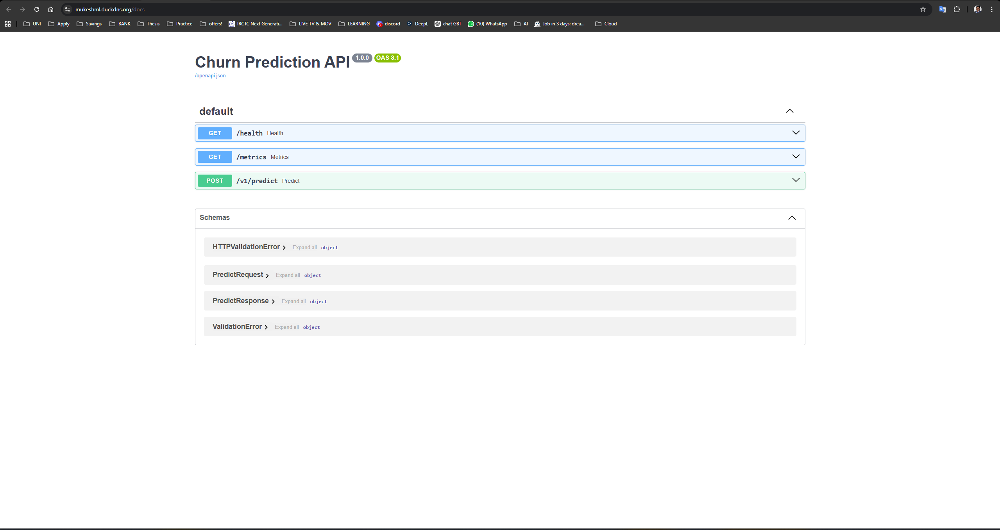
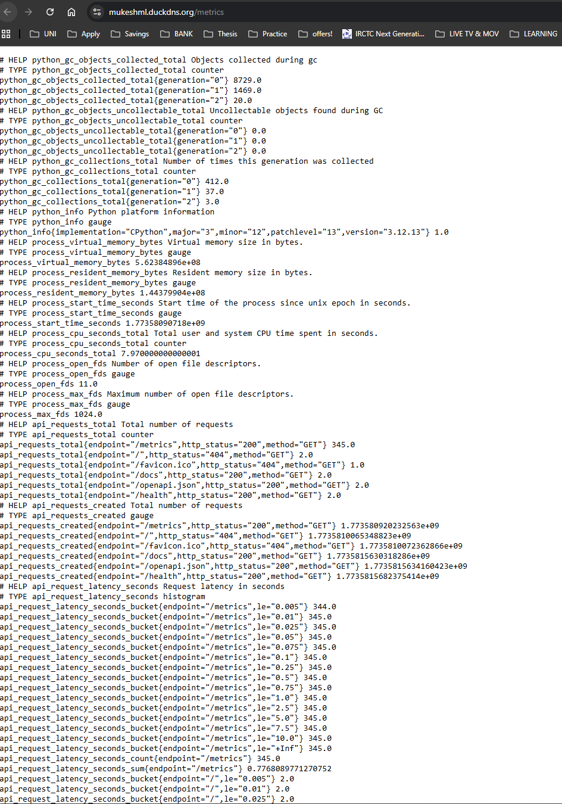
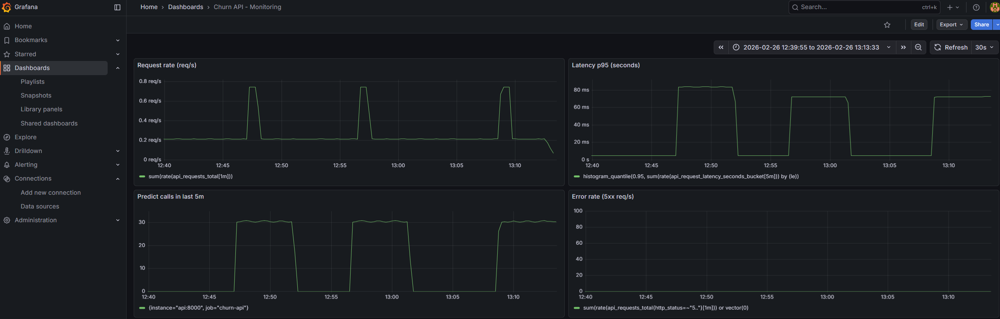
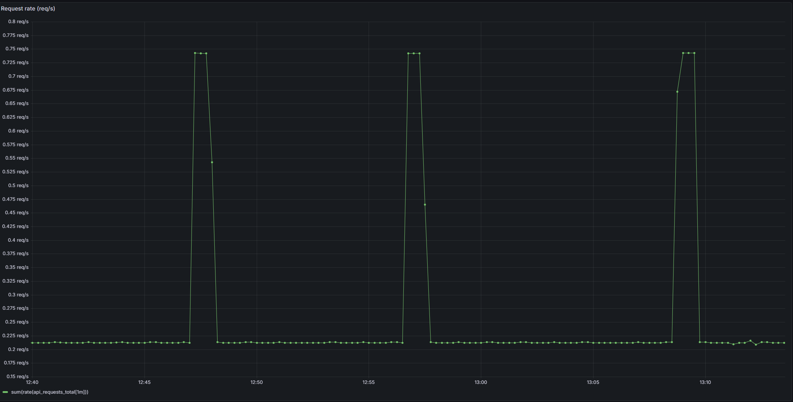
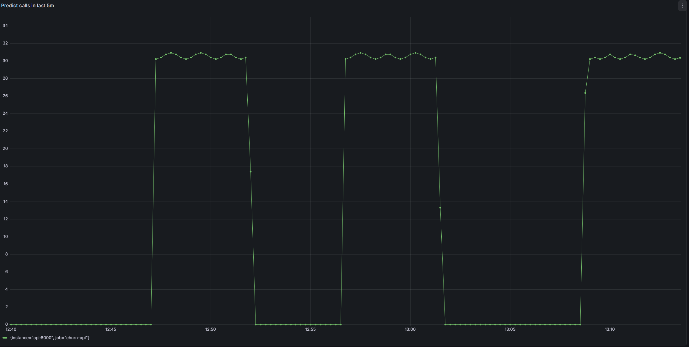
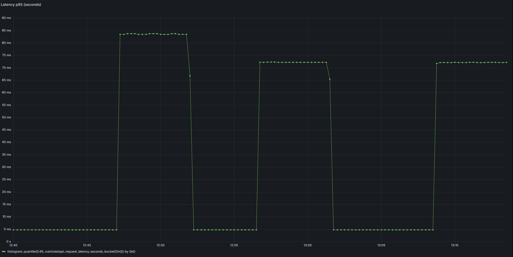
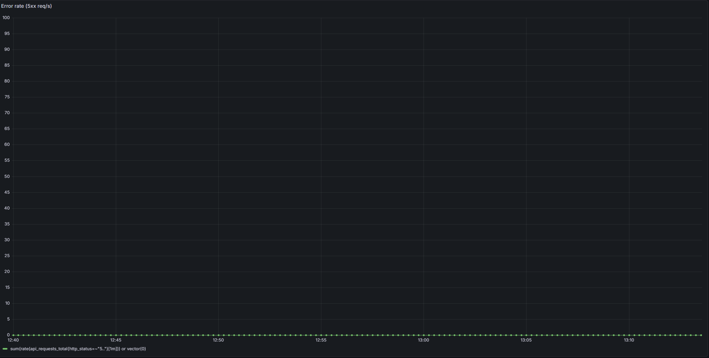
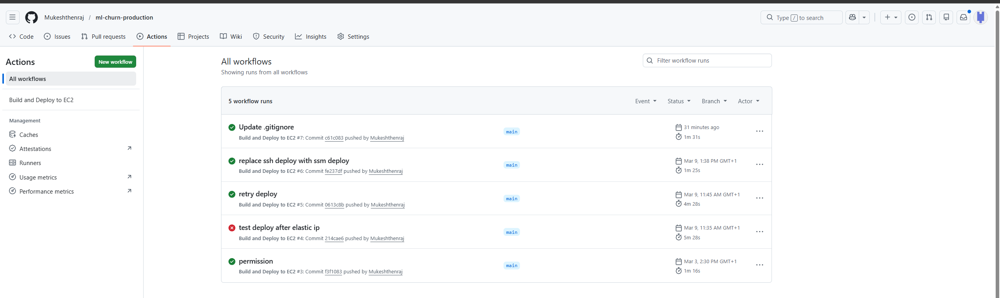
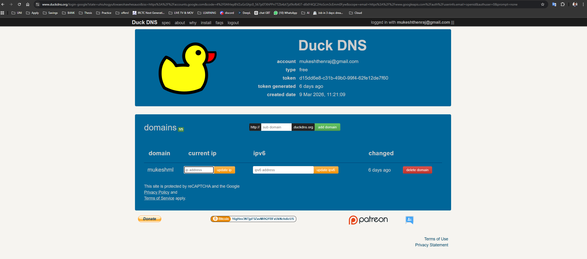

🚀 ML Churn Prediction Production System


A production-style Machine Learning system for predicting customer
churn. This project demonstrates how to deploy, monitor, and operate a
machine learning model in a production environment using modern MLOps
tools.
The system exposes a FastAPI inference API, runs inside Docker
containers, is deployed using Kubernetes, and includes
monitoring with Prometheus and Grafana. Deployment automation is
handled via GitHub Actions CI/CD, and the system can be deployed on
AWS EC2.
---
🏗 System Architecture

High-level workflow
User sends request to FastAPI prediction API
API loads trained churn model
Prediction is generated
Results are logged to PostgreSQL
Metrics are exposed to Prometheus
Dashboards visualized in Grafana
CI/CD automatically deploys updates via GitHub Actions
---
📦 Tech Stack
Machine Learning
Python
Scikit-learn
Pandas
Jupyter Notebooks
Backend API
FastAPI
Uvicorn
Data Storage
PostgreSQL
Containerization
Docker
Docker Compose
Orchestration
Kubernetes
Monitoring
Prometheus
Grafana
Infrastructure
AWS EC2
CI/CD
GitHub Actions
---
📂 Project Structure
    ml-churn-production
    │
    ├── src/                    # Application source code
    │   ├── api/                # FastAPI endpoints
    │   ├── db/                 # Database logic
    │   └── ml/                 # Model loading & prediction
    │
    ├── data/                   # Training data
    ├── notebooks/              # Model training notebooks
    ├── tests/                  # Unit tests
    │
    ├── k8s/                    # Kubernetes manifests
    ├── infra/                  # Infrastructure configs
    │   └── prometheus/
    │
    ├── docs/
    │   ├── architecture/       # System architecture diagram
    │   └── screenshots/        # Dashboard & API screenshots
    │
    ├── docker-compose.yml
    ├── Dockerfile
    ├── requirements.txt
    └── README.md

---
⚙️ Running the Project Locally
1️⃣ Clone the repository
    git clone https://github.com/YOUR_USERNAME/ml-churn-production.git
    cd ml-churn-production

2️⃣ Build Docker containers
    docker compose build

3️⃣ Start services
    docker compose up -d

4️⃣ Verify running containers
    docker compose ps

Expected services:
churn-api
churn-db
prometheus
grafana
---
🌐 API Endpoints
Health check
    GET /health

Prediction endpoint
    POST /v1/predict

Example request
``` json
{
  "tenure": 5,
  "monthly_charges": 75,
  "contract_type": "Month-to-month"
}
```
---
📡 API Documentation
Swagger UI automatically generated by FastAPI.

Access locally:
    http://localhost:8000/docs

---
📊 Monitoring
The system exposes Prometheus metrics for monitoring prediction
traffic, latency, and errors.
Metrics Endpoint
    GET /metrics


---
📈 Grafana Monitoring Dashboards
Dashboard Overview

Request Rate

Prediction Volume

Latency (p95)

Error Rate

---
🐳 Docker Deployment
The entire system runs inside containers.
Services included:
ML API
PostgreSQL
Prometheus
Grafana
Docker makes the project portable and reproducible.
---
☸ Kubernetes Deployment
The application can also run in a Kubernetes cluster.
Example components:
Deployment
Service
NodePort exposure
Container orchestration
Test locally with:
    kubectl apply -f k8s/

---
☁ AWS Deployment
The system can be deployed to AWS EC2.
Typical deployment flow
    GitHub → GitHub Actions → AWS EC2 → Docker containers

This enables automated CI/CD deployments.
---
🔄 CI/CD Pipeline
GitHub Actions automatically:
Builds Docker images
Runs tests
Deploys to server

---
🌍 Public Access
The project supports dynamic domain routing using DuckDNS.

---
🧪 Example Prediction Logs
Prediction requests are stored in PostgreSQL for auditing and
monitoring.
Example fields:
request_id
churn_probability
churn_label
latency_ms
timestamp
---
🎯 Key Learning Outcomes
This project demonstrates:
Production ML API deployment
Containerized ML systems
CI/CD for machine learning
Monitoring ML models
Kubernetes orchestration
Cloud deployment patterns
---
👨‍💻 Author
Mukesh Thenraj  
Automation & AI Engineer  
M.Sc Automation and Safety Engineering  
University of Duisburg-Essen
GitHub:
https://github.com/Mukeshthenraj
---
⭐ Future Improvements
Possible extensions:
Model drift monitoring
Feature store integration
Auto model retraining
Canary deployments
ML experiment tracking (MLflow)
---
🎯 Final Result
This project demonstrates a complete end-to-end ML production system
including:
✔ Model training  
✔ API deployment  
✔ Docker containers  
✔ Kubernetes orchestration  
✔ Monitoring & observability  
✔ CI/CD automation  
✔ Cloud deployment
