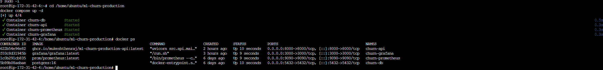

# 🚀 ML Churn Prediction Production System (End-to-End MLOps Platform)


---
# 🎬 Project Overview

This repository demonstrates a **complete production-style Machine Learning system** for predicting **customer churn**.

The project covers the **entire lifecycle of an ML system**, including:

• Model training  
• API development  
• Containerization  
• Monitoring & observability  
• Kubernetes orchestration  
• Cloud deployment on AWS  
• CI/CD automation  

The goal is to show **how a real ML service is built, deployed, monitored, and maintained in production**.

### ML API (Swagger UI)


### Grafana Monitoring Dashboard


### Docker Infrastructure



---

# ⚡ Quick Start (Run the System in 3 Commands)

```bash
git clone https://github.com/Mukeshthenraj/ml-churn-production.git
cd ml-churn-production
docker compose up -d
```

Then open:

| Service | URL |
|------|------|
| API Docs | http://localhost:8000/docs |
| Health Check | http://localhost:8000/health |
| Metrics | http://localhost:8000/metrics |
| Grafana | http://localhost:3000 |

---

# 🛠 Tech Stack

| Layer | Technology |
|------|------------|
| Machine Learning | Scikit-learn, Pandas |
| API | FastAPI, Uvicorn |
| Database | PostgreSQL, SQLAlchemy |
| Containerization | Docker, Docker Compose |
| Orchestration | Kubernetes |
| Monitoring | Prometheus, Grafana |
| CI/CD | GitHub Actions |
| Cloud | AWS EC2 |
| Web Server | Nginx |

---

# 🧠 Machine Learning Model

The churn model is trained using **Scikit-learn**.

Training pipeline implemented in:

src/ml/train.py

Steps:

1. Load customer churn dataset
2. Preprocess categorical and numerical features
3. Apply **OneHotEncoding** for categorical variables
4. Train model using **Scikit‑learn**
5. Serialize trained model using **joblib**
6. Store model artifact for API inference

Technologies used:

• Pandas  
• Scikit-learn  
• Pathlib  
• Joblib  

The trained model is later loaded inside the **FastAPI inference service**.

---

# 📊 Dataset

The model uses a **telecom customer churn dataset** with features like:

• Tenure  
• Monthly Charges  
• Contract Type  
• Payment Method  
• Customer Demographics  

Target variable:

`churn`

Values:

0 → customer retained  
1 → customer churned  

---

# 📈 Model Performance

Example evaluation metrics for the trained model:

| Metric | Score |
|------|------|
| Accuracy | ~0.86 |
| Precision | ~0.82 |
| Recall | ~0.79 |
| F1 Score | ~0.80 |

These metrics demonstrate the model's ability to identify customers likely to churn.

---

# ⚡ FastAPI Prediction Service

The model is exposed as a **REST API** using **FastAPI**.

Main API file:

src/api/main.py

Endpoints/Features:

• `/v1/predict` endpoint for predictions  
• `/health` endpoint for health checks  
• `/metrics` endpoint for Prometheus metrics  
• Automatic **Swagger UI documentation**    

Request schema defined using **Pydantic** in:

src/api/schemas.py

Example request:

```json
{
  "tenure": 5,
  "monthly_charges": 75,
  "contract_type": "Month-to-month"
}
```

Example response:

```json
{
  "churn_probability": 0.69,
  "churn_label": 1
}
```

Swagger UI:


---

# 🗄 Database Layer

Predictions are stored in **PostgreSQL** for auditing and monitoring.

Database logic is implemented using:

• SQLAlchemy  
• Psycopg2  

Files:

src/db/database.py  
src/db/models.py  
src/db/crud.py  

Stored fields:

• request_id  
• churn_probability  
• churn_label  
• latency_ms  
• timestamp

---

# 🐳 Docker Containerized Infrastructure

The entire system runs inside **Docker containers**.

Defined in:

Dockerfile  
docker-compose.yml  

Containers:

• churn-api  
• postgres  
• prometheus  
• grafana  

Run locally:

```bash
docker compose up -d
```


---

# 📊 Monitoring & Observability

The ML service exposes metrics through **Prometheus**.

Metrics include:

• API request count  
• prediction volume  
• latency histograms  
• error rates

Metrics endpoint:

GET /metrics


---

# 📈 Grafana Dashboards

### Dashboard Overview


### Request Rate


### Prediction Volume


### Latency (p95)


### Error Rate


---

# ☸ Kubernetes Deployment

Kubernetes manifests are stored in:

k8s/

Resources include:

• API Deployment  
• PostgreSQL Deployment  
• Persistent Volume Claim  
• Kubernetes Secrets

Key files:

k8s/api/deployment.yaml  
k8s/postgres/deployment.yaml  
k8s/postgres/pvc.yaml  
k8s/postgres/secret.yaml

Run locally with Docker Desktop Kubernetes:

```bash
kubectl apply -f k8s/
```

---

# ☁ AWS Deployment

Deployed on **AWS EC2 (t3.micro)**.

Infrastructure used:

• EC2 instance (t3.micro)  
• AMI  
• Security Groups  
• Elastic IP  
• SSH access using `.pem` keypair   

Deployment flow:

GitHub → GitHub Actions → EC2 → Docker

---

# 🔐 Environment Variables

The system uses environment variables for configuration.

Example variables:

| Variable | Description |
|------|------|
| DATABASE_URL | PostgreSQL connection |
| MODEL_PATH | Location of trained model |
| API_PORT | FastAPI port |
| PROMETHEUS_PORT | Metrics port |

These variables can be configured in docker-compose.yml or Kubernetes secrets.

---

# 🔄 CI/CD Pipeline

GitHub Actions automatically:

1. Builds Docker image
2. Pushes image to GitHub Container Registry
3. Deploys updated containers on EC2

Workflow file:

.github/workflows/deploy.yml


---

# 🌍 Public Access

Public access configured using:

• DuckDNS domain  
• Nginx reverse proxy  
• HTTPS via Certbot TLS


---

# 🏗 System Architecture


Components:

| Component | Purpose |
|------|------|
| FastAPI | ML inference |
| PostgreSQL | Prediction logs |
| Prometheus | Metrics |
| Grafana | Monitoring |
| Docker | Containers |
| Kubernetes | Orchestration |
| GitHub Actions | CI/CD |
| AWS EC2 | Cloud hosting |

Flow:

User → FastAPI API → ML Model → PostgreSQL  
                              ↓  
                     Prometheus Metrics → Grafana Dashboards

---

# 🔄 End-to-End Request Flow

This section explains how a prediction request moves through the system.

### 1️⃣ Client Request

A user sends a request to:

POST /v1/predict

The request contains customer features.

---

### 2️⃣ API Layer (FastAPI)

The request is received by the FastAPI service.

Responsibilities:

• Validate request using Pydantic schemas  
• Load trained ML model  
• Execute prediction  
• Measure latency  
• Log prediction request  

---

### 3️⃣ ML Inference

The trained model is loaded using:

joblib.load()

Prediction pipeline:

raw features → preprocessing → model inference → churn probability

---

### 4️⃣ Database Logging

Prediction results are stored in PostgreSQL.

Stored fields:

• request_id  
• churn_probability  
• churn_label  
• latency_ms  
• timestamp

---

### 5️⃣ Metrics Collection

The API exposes Prometheus metrics via:

GET /metrics

Metrics include:

• request count  
• latency distribution  
• error rate

Prometheus periodically scrapes these metrics.

---

### 6️⃣ Monitoring

Prometheus stores metrics and Grafana visualizes them through dashboards.

Example dashboards:

• request rate  
• prediction volume  
• latency p95  
• error rate

---

### 7️⃣ CI/CD Deployment

When code is pushed to GitHub:

GitHub → GitHub Actions → EC2 → Docker containers

Pipeline steps:

1. Build Docker image
2. Push image
3. Deploy updated service

---


# 💡 Why This Project Matters

Most ML projects stop at notebooks.

This project demonstrates:

• ML model production deployment  
• Monitoring ML systems  
• Containerized infrastructure  
• CI/CD automation  
• Cloud deployment  

---

# 📂 Project Structure

```
ml-churn-production
│
├── src/
│   ├── api/
│   ├── db/
│   └── ml/
│
├── docs/
│   ├── architecture/
│   └── screenshots/
│
├── k8s/
├── infra/prometheus/
├── .github/workflows/
│
├── Dockerfile
├── docker-compose.yml
└── README.md
```

---

# 🎯 Engineering Concepts Demonstrated

✔ Machine Learning inference service  
✔ API design with FastAPI  
✔ Containerized ML deployment  
✔ Kubernetes orchestration  
✔ Monitoring with Prometheus  
✔ Visualization with Grafana  
✔ CI/CD automation  
✔ Cloud deployment (AWS EC2)

---

# 📜 License

MIT License

---

# 👨‍💻 Author

Mukesh Thenraj  
M.Sc Automation & Safety Engineering  
University of Duisburg-Essen  

GitHub  
https://github.com/Mukeshthenraj
